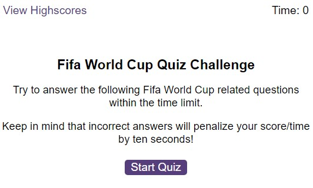

# Quiz Multiple-Choice Questions

### Repository description

This is an application that intends to simulate a timed Quiz with multiple-choice questions.  
When the game ends, it displays the highest scores and gives the user the ability to save their initials and their score.  
The application has a mobile-responsive user interface that will run in the browser and will present dynamically updated HTML and CSS through JavaScript code.  
The high scores table stores just the top 10 results.  
When a user gets a result higher than any other one in the table, the system automatically removes the lowest result and inserts the new one.  
The code is dynamic, so more questions can be added, and even the number of choices for each question can be different from question to question.  
>Note: Question number 4 has deliberately 6 possible choices.

## Instructions

When the user presses the start button a timer starts and the first question appears.
 
* Each multiple-choice question contains buttons for each answer;
* When the answer is clicked, the next question appears;
* If the answer clicked was incorrect then subtract 10 seconds from the timer.

The quiz should end when all questions are answered or the timer reaches 0.

### Mock-Up

The images below illustrates the Quiz Multiple-Choice Questions web page appearance:    

 
  
### Contributing

Why you should contribute to an open-source project?  
Contributing to open-source is a rewarding way to learn, teach, and build experience in just about any skill.
You don’t have to contribute code, there’s always a task for you on an open-source project.
Besides coding, you can contribute to user interface design, graphic design, writing, or organizing.

Ways you can contribute:

* [Submit bugs and feature requests](https://github.com/CZ-RBelo/QuizMultipleChoice/issues/)
* [Review source code changes](https://github.com/CZ-RBelo/QuizMultipleChoice/pulls)

> **Spell check errors**  
>Pull requests that fix spell-check errors are welcomed.  
>If you want to give feedback or report an issue, please create a [new GitHub issue](https://github.com/CZ-RBelo/QuizMultipleChoice/issues/new).  
>**Please check if a topic about your issue already exists!**

### Links

* [Github Repository](https://github.com/CZ-RBelo/QuizMultipleChoice)
* [Deployed Application](https://cz-rbelo.github.io/QuizMultipleChoice)

### Credits

### Contacts

If you require any further information, feel free to contact me at:
 
* Github Profile: [CZ-RBELO](https://github.com/CZ-RBelo/)  
* Email: [jr.belo@hotmail.com](mailto:jr.belo@hotmail.com)
* LinkedIn: [Rui Belo](https://linkedin.com/in/ruibelo)

---
### License
Licensed under the [MIT license](https://github.com/CZ-RBelo/QuizMultipleChoice/blob/main/LICENSE)

